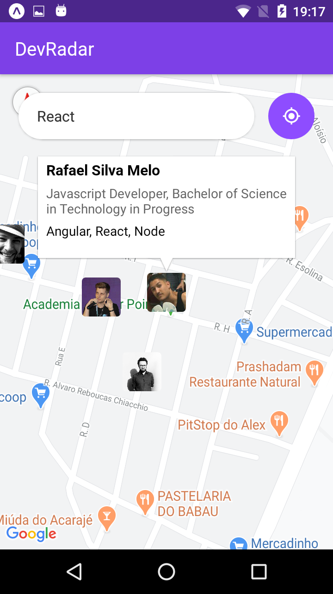
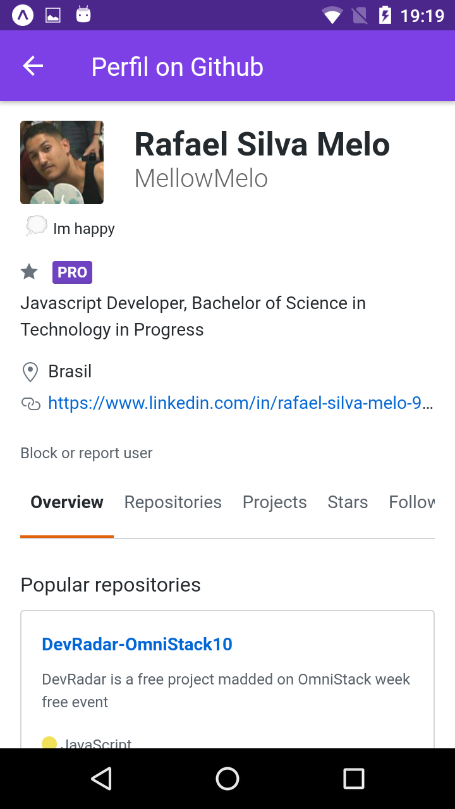

# DevRadar

> DegRadar is a project builds from the OmniStack Week launched by Rocketseat Company, with the objective to introduce the basic concepts of a javascript FullStack development.

#### DevRadar allows users to find other devs and view their github profiles inside a google maps interface by filtering by technology(ies).

#### Main Platforms and Frameworks used:
- NodeJS
- React-Naive
- ReactJS
#### Other Frameworks and Tecnologies:
- Express
- Socketio
- Expo
- MongoDB